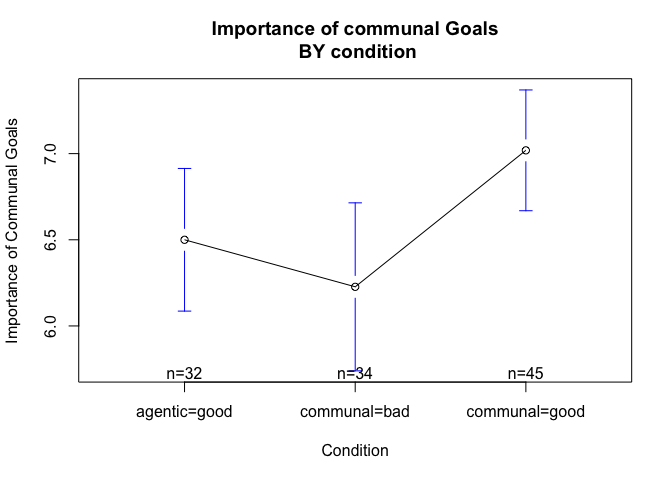

Communal Article + Essay Pilot (CEP)
================
Kate Block (with Ryan Villamin)
June 20, 2016

The STUDY
---------

This is a summary of of the analyses of the communal article + Essay pilot we ran in April, 2016 to test manipulations of communal goals/values. Each participants read an "psychology today" article and then wrote a short paragraph about how this might apply to their life. In this pilot we ran a sample of 157 men in one of three conditions:

-   communal = good: Article emphasizing that being communal is good for people.

-   communal = bad: Article emphasizing that being too communal can be harmful to people.

-   agentic = good: Article emphasizing that being agentic can be good for people.

Which participants can we trust?
================================

Who did the essay right?
------------------------

We coded essay in a number of ways to see who did and did not do our tasks right

-   Essay Length: How long was their essay
-   Essay content: Were they on topic, counter topic, or totally off topic
-   Whatabout\_Coded: How close were they to guessing the hypothesis

<!-- -->

    ##                Essay_Length
    ##                 2-4sentences 5+ sentences blank one sentence
    ##   agentic=good            31           14     3            3
    ##   communal=bad            28           21     2            0
    ##   communal=good           23           31     1            0

    ##                Essay_Content
    ##                 COUNTER TOPIC IN LINE UNRELATED
    ##   agentic=good              8      33         7
    ##   communal=bad              9      37         3
    ##   communal=good             4      47         3

    ##                Whatabout_Coded
    ##                 believed cover empty general suspicion Guessed 
    ##   agentic=good               5    19                 8        2
    ##   communal=bad               1    17                 4        4
    ##   communal=good              3    16                 6        1
    ##                Whatabout_Coded
    ##                 totally off
    ##   agentic=good           17
    ##   communal=bad           25
    ##   communal=good          29

Who passed manipulations checks?
--------------------------------

-   Attn\_check1: what was the source of the article
-   Attn\_check2: what was the topic of the article

<!-- -->

    ##                Atn_Check1
    ##                 CBC Don't Know Forbes NYT PT (correct)
    ##   agentic=good    0         14      0   5           32
    ##   communal=bad    0          9      0   4           38
    ##   communal=good   1         13      1   1           39

    ##                Atn_Check2
    ##                 agentic+ communal- communal+ don't know extraversion
    ##   agentic=good        41         0         4          3            2
    ##   communal=bad         1        48         1          0            0
    ##   communal=good        0         0        53          1            1

So, exclusions?
---------------

Based on these I for now decided to ONLY exclude those people who did NOT write the essay at all (n=6) and those who didn't manage to write about in line with the topic (n=34). This leaves us with a total sample of n = 117. It really sucks that so many people didn't follow instructions. This could be a factor of doing studies on campus in passing but could also skew results. So, you will see that later I also display results leaving these people in!

Analyses with people who did they essay in LINE with their topic.
=================================================================

### Essay Ratings

People rated what they did by

-   Difficulty\_Write: How difficult it was to write the essay

-   Well\_Written: How well written they found the article
-   Engaging: How engaging they found the article
-   Understand: whether they felt they could understand the article
-   Surprised: How surprised they were about the results.

Means of ratings of task by condition
-------------------------------------

| Condition\_TXT |  Difficulty\_Write|
|:---------------|------------------:|
| communal=good  |               2.93|
| communal=bad   |               3.35|
| agentic=good   |               3.27|

| Condition\_TXT |  Well\_Written|  Engaging|  Understand|  Surprised|
|:---------------|--------------:|---------:|-----------:|----------:|
| communal=good  |           5.02|      4.73|        5.82|       2.34|
| communal=bad   |           4.78|      4.89|        5.43|       3.54|
| agentic=good   |           4.70|      4.45|        5.48|       2.97|

### Condition differences in surprise

Ratings of the task only differed by condition on how surprising they found the articles topic. Here People found the communal=bad topic to be most surprising.

    ##                Df Sum Sq Mean Sq F value  Pr(>F)   
    ## Condition_TXT   2  30.06  15.029   5.697 0.00438 **
    ## Residuals     114 300.71   2.638                   
    ## ---
    ## Signif. codes:  0 '***' 0.001 '**' 0.01 '*' 0.05 '.' 0.1 ' ' 1

    ##   Tukey multiple comparisons of means
    ##     95% family-wise confidence level
    ## 
    ## Fit: aov(formula = Surprised ~ Condition_TXT, data = dataset.attn)
    ## 
    ## $Condition_TXT
    ##                                  diff        lwr        upr     p adj
    ## communal=bad-agentic=good   0.5708436 -0.3526327  1.4943198 0.3101648
    ## communal=good-agentic=good -0.6292714 -1.5052100  0.2466671 0.2073672
    ## communal=good-communal=bad -1.2001150 -2.0477803 -0.3524497 0.0030045

DV ratings
----------

We had people rate 7 communal and 7 agentic values on three dimensions

-   How important do each of the following goals seem to you personally? (\_imp)
-   How satisfying would it be for you to fulfill each of the following goals? (\_Sat)
-   In the long run, how beneficial would fulfilling each of the following goals be for you personally? (\_Ben)

### Means of communal value ratings by condition

There is a significan effect of condition on all of those. For all, specifically the communal=good condition is different from the communal = bad condition

| Condition\_TXT |  comm\_imp|  comm\_Sat|  comm\_Ben|
|:---------------|----------:|----------:|----------:|
| communal=good  |       7.02|       7.20|       7.34|
| communal=bad   |       6.23|       6.46|       6.45|
| agentic=good   |       6.50|       6.79|       7.05|

### Plots for these

### ANOVA for condition differences in Importance of communal values

    ##                Df Sum Sq Mean Sq F value Pr(>F)  
    ## Condition_TXT   2  12.88   6.438    4.21 0.0173 *
    ## Residuals     108 165.13   1.529                 
    ## ---
    ## Signif. codes:  0 '***' 0.001 '**' 0.01 '*' 0.05 '.' 0.1 ' ' 1
    ## 6 observations deleted due to missingness

    ##   Tukey multiple comparisons of means
    ##     95% family-wise confidence level
    ## 
    ## Fit: aov(formula = comm_imp ~ Condition_TXT, data = dataset.attn)
    ## 
    ## $Condition_TXT
    ##                                  diff        lwr       upr     p adj
    ## communal=bad-agentic=good  -0.2731092 -0.9968626 0.4506441 0.6435156
    ## communal=good-agentic=good  0.5190476 -0.1604644 1.1985597 0.1694356
    ## communal=good-communal=bad  0.7921569  0.1244269 1.4598868 0.0156779

### ANOVA for condition differences in Satisfaction of communal values

    ##                Df Sum Sq Mean Sq F value Pr(>F)  
    ## Condition_TXT   2  10.44   5.219   3.464 0.0348 *
    ## Residuals     108 162.72   1.507                 
    ## ---
    ## Signif. codes:  0 '***' 0.001 '**' 0.01 '*' 0.05 '.' 0.1 ' ' 1
    ## 6 observations deleted due to missingness

    ##   Tukey multiple comparisons of means
    ##     95% family-wise confidence level
    ## 
    ## Fit: aov(formula = comm_Sat ~ Condition_TXT, data = dataset.attn)
    ## 
    ## $Condition_TXT
    ##                                  diff         lwr       upr     p adj
    ## communal=bad-agentic=good  -0.3279221 -1.05162385 0.3957797 0.5304693
    ## communal=good-agentic=good  0.4065500 -0.25889566 1.0719956 0.3182451
    ## communal=good-communal=bad  0.7344720  0.06299942 1.4059447 0.0284681

### ANOVA for condition differences in how beneficial communal values are

    ##                Df Sum Sq Mean Sq F value Pr(>F)   
    ## Condition_TXT   2  16.29   8.147    5.36  0.006 **
    ## Residuals     111 168.72   1.520                  
    ## ---
    ## Signif. codes:  0 '***' 0.001 '**' 0.01 '*' 0.05 '.' 0.1 ' ' 1
    ## 3 observations deleted due to missingness

    ##   Tukey multiple comparisons of means
    ##     95% family-wise confidence level
    ## 
    ## Fit: aov(formula = comm_Ben ~ Condition_TXT, data = dataset.attn)
    ## 
    ## $Condition_TXT
    ##                                  diff        lwr       upr     p adj
    ## communal=bad-agentic=good  -0.5967262 -1.3082983 0.1148459 0.1188867
    ## communal=good-agentic=good  0.2956134 -0.3785794 0.9698062 0.5523240
    ## communal=good-communal=bad  0.8923395  0.2406099 1.5440692 0.0042918

Ratings of agentic values by condition
--------------------------------------

Here are the means by condition. There is no significant condition differences here.

| Condition\_TXT |  agen\_imp|  agen\_Sat|  agen\_Ben|
|:---------------|----------:|----------:|----------:|
| communal=good  |       5.84|       5.89|       6.32|
| communal=bad   |       6.26|       6.46|       6.46|
| agentic=good   |       5.90|       6.29|       6.53|

PART B. Analyses with less stringent exclusion criteria
=======================================================

So, Ryan and I have been thinking about it and we cannot tell if we should actually remove those people who write against their condition. There is quite a large number of people who wrote that they disagree or just wrote random stuff so it's possible by excluding those we articificially create condition differences. Another reasonable thing to do is just exclude those who didn't do the essay at all (n=6) and those who learned english very late in life (n = 9). This is our best way of excluding those who didn't do it at all or who we have reason to believe might not have understood the article. N HERE IS 142.

### PART B. Essay Ratings

People rated what they did by

-   Difficulty\_Write: How difficult it was to write the essay
-   Well\_Written: How well written they found the article
-   Engaging: How engaging they found the article
-   Understand: whether they felt they could understand the article
-   Surprised: How surprised they were about the results.

PART B. Means of ratings of task by condition
---------------------------------------------

| Condition\_TXT |  Difficulty\_Write|
|:---------------|------------------:|
| communal=good  |               2.98|
| communal=bad   |               3.29|
| agentic=good   |               3.45|

| Condition\_TXT |  Well\_Written|  Engaging|  Understand|  Surprised|
|:---------------|--------------:|---------:|-----------:|----------:|
| communal=good  |           4.92|      4.63|        5.73|       2.49|
| communal=bad   |           4.64|      4.60|        5.40|       3.87|
| agentic=good   |           4.55|      4.23|        5.41|       3.02|

### PART B. Condition differences in surprise

Ratings of the task only differed by condition on how surprising they found the articles topic. Here People found the communal=bad topic to be most surprising.

    ##                Df Sum Sq Mean Sq F value   Pr(>F)    
    ## Condition_TXT   2   46.4  23.194    8.97 0.000217 ***
    ## Residuals     139  359.4   2.586                     
    ## ---
    ## Signif. codes:  0 '***' 0.001 '**' 0.01 '*' 0.05 '.' 0.1 ' ' 1

    ##   Tukey multiple comparisons of means
    ##     95% family-wise confidence level
    ## 
    ## Fit: aov(formula = Surprised ~ Condition_TXT, data = dataset.attn4)
    ## 
    ## $Condition_TXT
    ##                                  diff        lwr        upr     p adj
    ## communal=bad-agentic=good   0.8439394  0.0362607  1.6516181 0.0383261
    ## communal=good-agentic=good -0.5321612 -1.3091197  0.2447972 0.2395238
    ## communal=good-communal=bad -1.3761006 -2.1483278 -0.6038735 0.0001284

PART B. DV ratings
------------------

We had people rate 7 communal and 7 agentic values on three dimensions

-   How important do each of the following goals seem to you personally? (\_imp)
-   How satisfying would it be for you to fulfill each of the following goals? (\_Sat)
-   In the long run, how beneficial would fulfilling each of the following goals be for you personally? (\_Ben)

### PART B. Means of communal value ratings by condition

Note that condition only has a significant effect on importance and on beneficial. No effect on how satisfying communal values feel.

| Condition\_TXT |  comm\_imp|  comm\_Sat|  comm\_Ben|
|:---------------|----------:|----------:|----------:|
| communal=good  |       6.86|       6.95|       7.10|
| communal=bad   |       6.13|       6.36|       6.39|
| agentic=good   |       6.28|       6.52|       6.71|

### PART B. ANOVA for condition differences in Importance of communal values

    ##                Df Sum Sq Mean Sq F value Pr(>F)  
    ## Condition_TXT   2  13.88   6.942   3.905 0.0225 *
    ## Residuals     131 232.87   1.778                 
    ## ---
    ## Signif. codes:  0 '***' 0.001 '**' 0.01 '*' 0.05 '.' 0.1 ' ' 1
    ## 8 observations deleted due to missingness

    ##   Tukey multiple comparisons of means
    ##     95% family-wise confidence level
    ## 
    ## Fit: aov(formula = comm_imp ~ Condition_TXT, data = dataset.attn4)
    ## 
    ## $Condition_TXT
    ##                                  diff         lwr       upr     p adj
    ## communal=bad-agentic=good  -0.1460926 -0.84001750 0.5478323 0.8718680
    ## communal=good-agentic=good  0.5783972 -0.08459268 1.2413871 0.1004915
    ## communal=good-communal=bad  0.7244898  0.06588976 1.3830898 0.0272901

### PART B. ANOVA for condition differences in Satisfaction of communal values

    ##                Df Sum Sq Mean Sq F value Pr(>F)
    ## Condition_TXT   2   8.66   4.330   2.189  0.116
    ## Residuals     133 263.13   1.978               
    ## 6 observations deleted due to missingness

    ##   Tukey multiple comparisons of means
    ##     95% family-wise confidence level
    ## 
    ## Fit: aov(formula = comm_Sat ~ Condition_TXT, data = dataset.attn4)
    ## 
    ## $Condition_TXT
    ##                                  diff       lwr       upr     p adj
    ## communal=bad-agentic=good  -0.1584416 -0.886789 0.5699059 0.8638727
    ## communal=good-agentic=good  0.4278222 -0.255087 1.1107313 0.3014199
    ## communal=good-communal=bad  0.5862637 -0.114897 1.2874244 0.1206731

### PART B. ANOVA for condition differences in how beneficial communal values are

    ##                Df Sum Sq Mean Sq F value Pr(>F)  
    ## Condition_TXT   2  12.32   6.160   3.227 0.0428 *
    ## Residuals     134 255.79   1.909                 
    ## ---
    ## Signif. codes:  0 '***' 0.001 '**' 0.01 '*' 0.05 '.' 0.1 ' ' 1
    ## 5 observations deleted due to missingness

    ##   Tukey multiple comparisons of means
    ##     95% family-wise confidence level
    ## 
    ## Fit: aov(formula = comm_Ben ~ Condition_TXT, data = dataset.attn4)
    ## 
    ## $Condition_TXT
    ##                                  diff         lwr       upr     p adj
    ## communal=bad-agentic=good  -0.3209534 -1.03173670 0.3898298 0.5342006
    ## communal=good-agentic=good  0.3943313 -0.28957072 1.0782333 0.3613751
    ## communal=good-communal=bad  0.7152847  0.04454564 1.3860238 0.0336303

PART B. Ratings of agentic values by condition
----------------------------------------------

Here are the means by condition. There is no significant condition differences for these alternative exclusion criteria either.

| Condition\_TXT |  agen\_imp|  agen\_Sat|  agen\_Ben|
|:---------------|----------:|----------:|----------:|
| communal=good  |       5.91|       5.97|       6.34|
| communal=bad   |       6.05|       6.30|       6.40|
| agentic=good   |       5.68|       6.06|       6.28|
